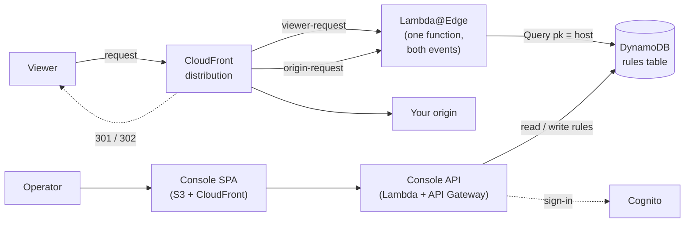
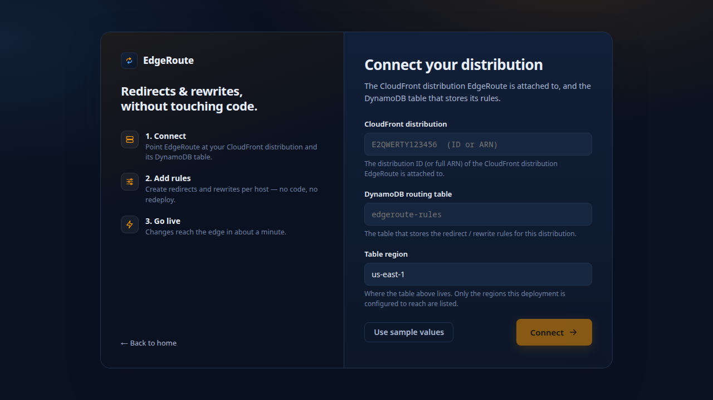
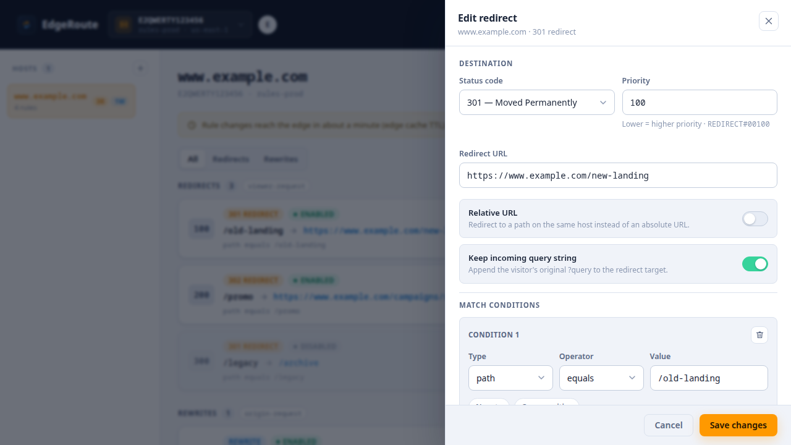
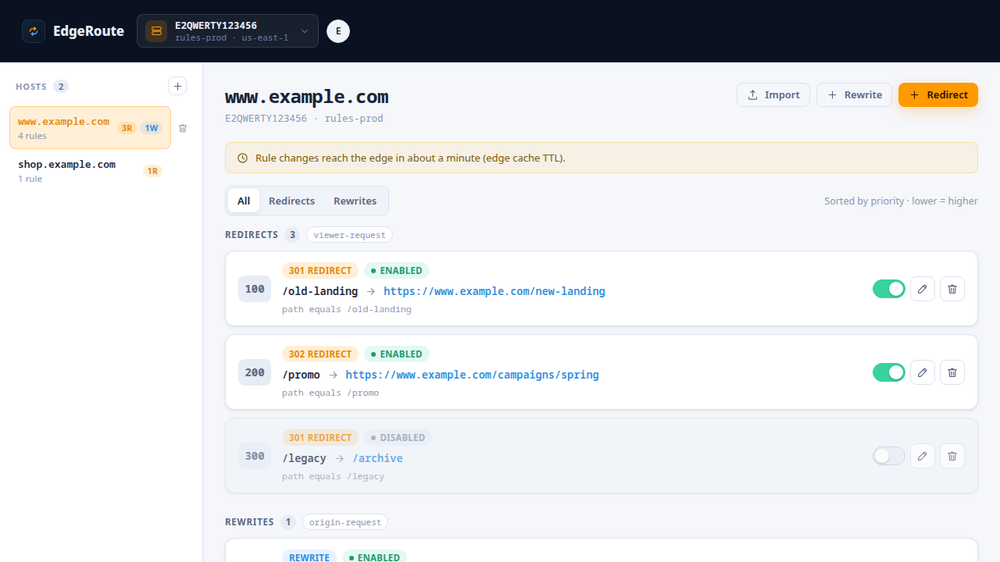
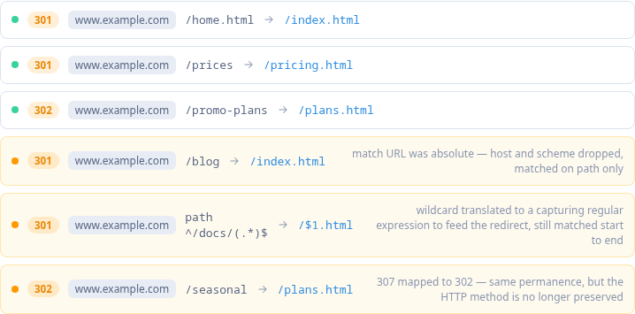

# cloudfront-redirect-rules

> Pluggable, DynamoDB-backed redirect & rewrite rules for **any** CloudFront distribution — a Lambda@Edge you attach to your own distro. It never manages your distribution.

Two halves, both working:

- **The data plane** (`infra/`) — the product. A Terraform module that creates the rules table and the Lambda@Edge, and outputs the ARNs you attach to your distribution.
- **The control plane** (`console/`) — a management API and a web console for editing the rules: Cognito sign-in with viewer/editor roles, a registry of rule tables, hosts, and redirect/rewrite rules with an enable/disable toggle.

Neither half is required by the other. Rules are ordinary DynamoDB items described by the schemas in `shared/`, so the data plane runs perfectly well against a table you write to yourself.

## Architecture



One Lambda@Edge, associated on both events: **viewer-request** answers redirects
with a `Location` header and never reaches your origin, while **origin-request**
rewrites the path or swaps the origin and does. Both read the same DynamoDB
table, and the console is the only thing that writes to it.

The two planes share nothing but that table. A rule written by hand with the AWS
CLI works exactly as one written in the console.

## Quickstart

Zero to a working demo. This deploys `examples/infra`, which creates its **own**
CloudFront distribution and a small S3 origin, so nothing here touches a
distribution you already run — attaching to one of those is [below](#how-it-plugs-in).

The full walkthrough, including the parts this compresses, is in
[DEPLOY.md](DEPLOY.md).

### Prerequisites

- Terraform **≥ 1.7**, Node **20+**, npm, and the **AWS CLI** (the console's
  upload step shells out to `aws s3 sync`)
- An AWS account you are happy to create a CloudFront distribution in, with
  `AWS_PROFILE` and `AWS_REGION` both exported:

  ```bash
  export AWS_PROFILE=<your-profile>
  export AWS_REGION=us-east-1
  aws sts get-caller-identity          # confirm the account before applying
  ```

Nothing in this repo pins an account or a profile, so whatever is in your
environment is what gets deployed to. `AWS_REGION` is not optional and its
absence fails in a confusing place — see DEPLOY.md for why.

A cold deploy is 30-40 minutes, nearly all of it CloudFront.

### 1. Deploy the data plane

```bash
cd examples/infra
terraform init
terraform apply

terraform output cloudfront_domain_name       # the demo site
terraform output cloudfront_distribution_id   # the console's connect screen wants this
terraform output table_name
terraform output table_arn                    # step 2 wants this
```

That is the product: a rules table, one Lambda@Edge published and associated on
both events, and a distribution to demonstrate it against.

### 2. Deploy the control plane

```bash
cd ../../console/api/infra
cp sandbox.tfvars.example sandbox.tfvars
```

Two settings need a value from you. **`target_table_arns`** is the `table_arn`
from step 1 — it is empty by default, and empty means the API can reach no rules
table at all, so the console lists hosts and then fails on every one of them.
**`cognito_domain_prefix`** names the hosted sign-in UI and has to be unique
across every AWS account, not just yours.

```bash
terraform init
terraform apply -var-file=sandbox.tfvars
terraform output api_endpoint
terraform output cognito_domain
terraform output user_pool_client_id
```

Then the console itself, with those three values in its own `sandbox.tfvars`:

```bash
cd ../../console/ui/infra
cp sandbox.tfvars.example sandbox.tfvars   # api_endpoint, cognito_domain, cognito_client_id
terraform init
terraform apply -var-file=sandbox.tfvars
terraform output console_url
```

Sign-in does not work yet: Cognito has never heard of the console's domain, which
did not exist until that apply. Pointing it back — and creating the accounts that
sign in — is [steps 4 and 5 of DEPLOY.md](DEPLOY.md#4-point-cognito-at-the-console),
two commands and a user.

### 3. Connect the console

Open `console_url` and sign in. The first screen asks which distribution and
table to manage — the `cloudfront_distribution_id` and `table_name` from step 1,
and the region they are in.



The answer is kept in this browser, not on the server, and the switcher in the
bar swaps between several.

### 4. Create your first rule

Add a host — the demo distribution's own domain, from `cloudfront_domain_name` —
then **Redirect**, and fill in:

- **Status code** `301`
- **Priority** `100` — lower runs first, and it is the rule's key
- **Redirect URL** where the visitor should end up
- **Match conditions**: `path` `equals` `/old-landing`



Save, and the rule joins the host's list. Redirects and rewrites are separate
sequences with independent priorities, because they run at different CloudFront
events.



In a hurry? `./seed-demo.sh` in `examples/infra` writes the demo host and three
rules — a 301, a 302 and a rewrite — and is safe to re-run.

**Already have rules somewhere else?** **Import** in the host header reads an
Akamai Edge Redirector export — CSV or `matchRules` JSON — and previews every
row before writing any of them: what each rule became, what was lost in
translation, and which rows cannot be imported at all and why. Nothing is
written until you accept the preview, and re-importing the same file is safe: a
rule identical to one already there is counted, not duplicated.



### 5. See it live

```bash
curl -i "https://$(terraform -chdir=examples/infra output -raw cloudfront_domain_name)/old-landing"
# → HTTP/2 301
#    location: https://…/new-landing
```

> **Rule changes take about a minute to appear.** The function caches what it
> reads from DynamoDB for `cache_ttl_ms` — 60000 by default — so a rule you just
> saved is live at an edge once that cache expires there. A `curl` straight after
> saving can legitimately return the old answer, or no redirect at all. This is
> the one thing to know before demonstrating it to anyone: wait a minute, then
> curl.

Two more from the seeded set, if you ran it:

```bash
curl -i "https://…/promo"        # 302
curl -i "https://…/old-pricing"  # 200, serving /pricing.html — a rewrite, not a redirect
```

The third is the one worth watching. Rewrites are evaluated at origin-request,
where the `Host` header is already the origin's, so it only matches because
viewer-request carried the viewer's hostname across in a header. If it 404s, that
mechanism is broken rather than the rule.

### 6. Tear down

Reverse order, and pass the var files — the Cognito settings have no defaults, so
`destroy` stops and asks for them otherwise:

```bash
cd console/ui/infra        && terraform destroy -var-file=sandbox.tfvars
cd ../../console/api/infra && terraform destroy -var-file=sandbox.tfvars
cd ../../examples/infra    && terraform destroy
```

The data plane's first `destroy` usually fails to delete the function: a
Lambda@Edge replica lives on for 15 minutes to an hour after the distribution
stops using it. That is expected — wait, then destroy again. [DEPLOY.md's
teardown](DEPLOY.md#8-tear-down) lists the other two things that interrupt it.

## How it plugs in

The Terraform module in `infra/` creates a DynamoDB rules table and a Lambda@Edge (published version), and outputs two qualified ARNs. You attach them to **your own** distribution with two `lambda_function_association` blocks:

- **viewer-request** → redirects (301/302)
- **origin-request** → rewrites (rewrite the path and/or switch the request to a different origin)

The module takes no input about your distribution and never touches it. What it does ask of your distribution is small, but it is not nothing:

1. **Both associations**, as above. Rules are keyed on the hostname the viewer asked for, and CloudFront has replaced the `Host` header with the origin's domain by the time origin-request runs — so viewer-request is what carries that hostname across, in `X-EdgeRoute-Viewer-Host`. Redirects work either way; rewrites without viewer-request are looked up under the origin's domain, and on a distribution that forwards viewer headers, under whatever hostname the client chose to send. Attaching both is therefore a security requirement, not only a functional one.
2. **Forward that header to the origin**, in an origin request policy on each behavior the associations run on. CloudFront drops a header no policy names, even one added at viewer-request moments earlier — and then no rewrite rule ever matches. The header name is the module's `viewer_host_header` output. If any rule uses a country condition, the behavior must also ask for `CloudFront-Viewer-Country` — see [modules/edge](infra/modules/edge/README.md#wiring-it-into-an-existing-distribution).

Redirects need only the first. Rewrites need both, and both failures are silent from outside: the request simply reaches your origin unchanged. The function logs a warning when it reaches origin-request with no hostname, which is the fastest way to tell the two apart. See [modules/edge](infra/modules/edge/README.md#wiring-it-into-an-existing-distribution) for the policy, and [infra/lambda](infra/lambda/README.md#the-host-a-rule-is-keyed-on) for why any of this is necessary.

## Repo layout

```
cloudfront-redirect-rules/
├── shared/                          # JSON Schemas — the rule contract (single source of truth)
│   ├── redirect-rule.schema.json    # erMatchRule
│   ├── rewrite-rule.schema.json     # frMatchRule
│   ├── examples/                    # valid example items (with DynamoDB keys), validated in CI
│   └── test/validate.ts             # ajv validation of examples ↔ schemas
├── infra/                           # the data plane
│   ├── modules/table/               # DynamoDB rules table
│   ├── modules/edge/                # Lambda@Edge (published version) + IAM
│   └── lambda/                      # the function itself — TypeScript, bundled by build.mjs
├── console/                         # the control plane
│   ├── api/                         # Lambda + API Gateway; openapi.yaml is the published contract
│   └── ui/                          # React SPA (Vite), with vitest and Playwright suites
├── examples/infra/                  # a complete example deployment, plus seed-demo.sh
├── deploy/                          # per-environment tfvars and the CI deployment story
├── docs/screenshots/                # the console images this README embeds
├── DEPLOY.md                        # deploying the whole thing to a sandbox by hand
├── .github/workflows/               # ci.yml + deploy-dev.yml
├── package.json                     # npm workspaces root
└── tsconfig.base.json               # shared TS compiler options
```

| Path       | What it is                                                                                             |
| ---------- | ------------------------------------------------------------------------------------------------------ |
| `infra/`   | **The data plane**: pluggable Terraform module — DynamoDB table + Lambda@Edge                          |
| `shared/`  | JSON Schemas for redirect (`erMatchRule`) / rewrite (`frMatchRule`) rules, plus DynamoDB key semantics |
| `console/` | **The control plane**: management API + web console for the rules                                      |
| `deploy/`  | What CI needs to deploy an environment, and what has to exist before its first run                     |

Each directory has its own README with the detail: [shared](shared/README.md), [infra](infra/README.md), [infra/lambda](infra/lambda/README.md), [console](console/README.md), [console/api](console/api/README.md), [deploy](deploy/README.md).

## Notes & constraints

- Runtime is **Lambda@Edge** (it can query DynamoDB). CloudFront Functions were evaluated and rejected: no network access.
- Lambda@Edge deploys in `us-east-1` regardless of your table region or distribution.
- Origin-request rewrites fire on cache misses — your cache policy affects observed behavior.
- Rule changes propagate in ~1 minute (edge cache TTL).

## Development

Requires **Node 20+**. This is an npm-workspaces monorepo; install once from the root.

```bash
npm ci            # install all workspaces
npm run lint      # eslint + prettier --check
npm run format    # prettier --write (fix formatting)
npm run typecheck # tsc --noEmit across workspaces (--if-present)
npm test          # runs each workspace's tests (--if-present)
```

To work on just one workspace, target it with `-w`:

```bash
npm test -w shared                        # validate shared/examples against the schemas
npm run dev -w console/api                # the API on localhost, against a real table
npm run dev -w console/ui                 # the console, proxying /api to the above
npm run test:e2e -w console/ui            # Playwright, with the API stubbed in the page
npm run openapi:lint -w console/api       # redocly lint
npm run generate:api -w console/ui        # regenerate the client types from openapi.yaml
```

`console/ui/src/api/schema.gen.ts` is generated from `console/api/openapi.yaml`. Edit the spec, never the generated file — CI fails if the two disagree (`generate:api:check`).

### What CI runs

`.github/workflows/ci.yml`, on every pull request and on push to `main`:

| Job                                   | What it does                                                         |
| ------------------------------------- | -------------------------------------------------------------------- |
| Lint (eslint + prettier)              | `npm run lint`                                                       |
| Typecheck (tsc --noEmit) + API bundle | `npm run typecheck`, `generate:api:check`, and the API bundle builds |
| Validate shared schemas + OpenAPI     | `npm test` across workspaces, then `redocly lint`                    |
| Console E2E (Playwright)              | `npm run test:e2e -w console/ui`, report uploaded as an artifact     |
| Terraform (fmt + validate + test)     | `fmt -check` over every stack, then `validate` + `test` per module   |

Run at least lint, typecheck and `npm test` locally before opening a PR.

Separately, `.github/workflows/deploy-dev.yml` deploys the sandbox dev environment on every push to `dev` (and on demand), after re-running the checks. See [deploy/README.md](deploy/README.md).

### Code comments

The comments here carry the _why_ — a constraint that is not visible from the code, a decision that looks arbitrary until you know what it rules out. That is worth keeping. What is not worth keeping is length: a reviewer reading a diff should not have to read around the prose to find the change.

So, roughly:

- **Inline** (`//`, a few lines): the non-obvious reason for _this_ line or block. If it runs past ~5 lines, it is explaining the module, not the line.
- **Module or function docblock** (`/** … */`): what the unit is for, and the decisions that shape the whole of it. One paragraph, ideally.
- **A README**: anything a reader needs _before_ opening the file — storage semantics, wiring requirements, the shape of a contract. Long-form belongs here, where it can be read in order.

Two things not to write: a comment restating what the next line plainly does, and the history of how the code got this way — that is what `git log` and the PR are for. When a comment and the code disagree, the comment is the bug.
